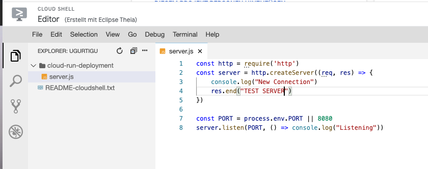
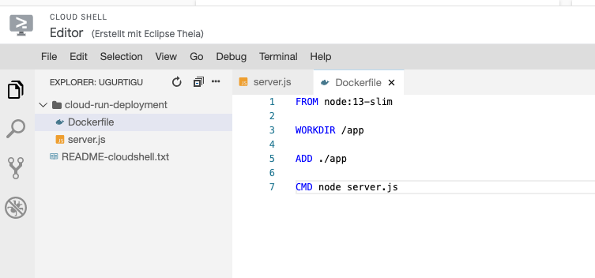
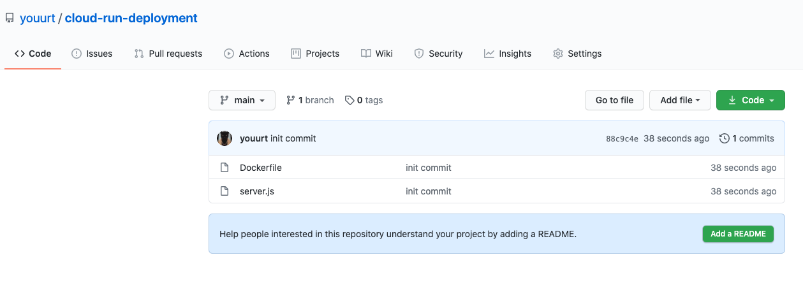
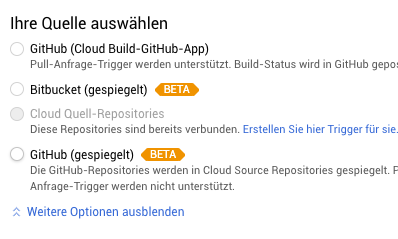
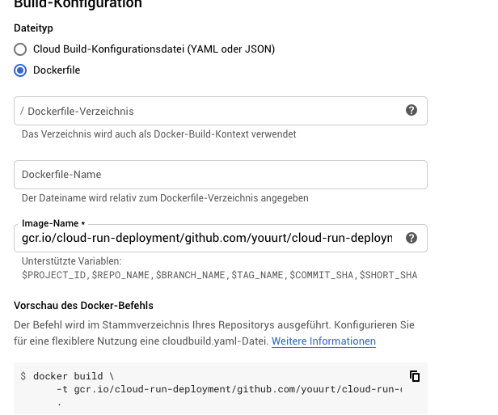
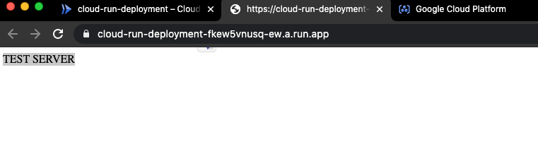
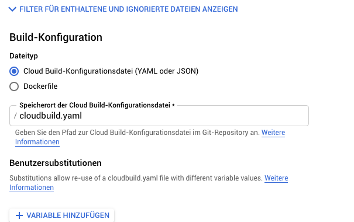
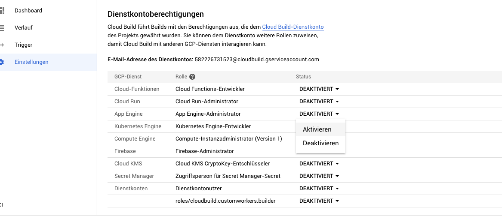
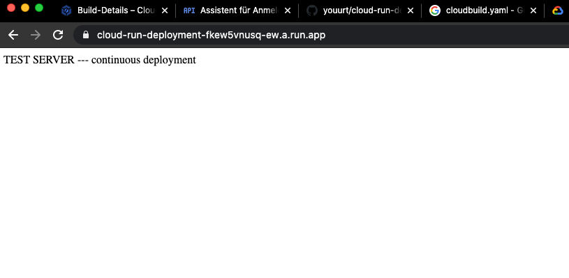

# Continous Deployment with Cloud Build & Cloud Run

## 1. Make an application & docker image
- mkdir and cd to a project folder
- create new project with a server file and a Dockerfile in the project folder (could be node.js server, or any type of server application) on google clou


- the server should listen to the environment port
```shell
docker build -t [PROJECT_NAME]
```

- the docker file should be built

## 2. Connect to github to make continuous integration
- create a repo with the same files (server file, Dockerfile)


## 3. Connect github to cloud build
- enable cloud build api
- connect new repo with trigger (choose github mirrored) and authenticate with oauth

- select repository & connect 

- every time when google sees a commit it will run what we have configured here, this is the build configuration we need at first, later we will change this to cloud build wiht a yaml file
- run trigger, the build is started 
## 4. Cloud run integration
- create a service and select container image and location (allow unauthenticated invocations)

- the server is now running on cloud run

## 5. Combine cloud build with cloud run
- we need to automatically deploy with cloud build 
- first change cloud build to build with cloudbuild.yaml instead of Dockerfile
- go to cloud build - triggers - edit trigger and change build configurations

- make a new cloudbuild.yaml (with the same project name) and commit it to the repo

```shell
steps:
- name: 'gcr.io/cloud-builders/docker'
  args: ['build', '-t', 'gcr.io/cloud-run-deployment/cloud-run-deployment:$SHORT_SHA', '.']
- name: 'gcr.io/cloud-builders/docker'
  args: ['push', 'gcr.io/cloud-run-deployment/cloud-run-deployment:$SHORT_SHA']
```
- we have a new build with cloudbuild.yaml
- deploy image with gcloud in the terminal

```shell
gcloud beta run deploy [NAME-OF-PROJECT][--REGION][--PLATFORM][--IMAGE]
```


- this command has be be copied into the cloudbuild.yaml file like so, the new cloudbuild.yaml looks like this now:

```shell
steps:
- name: 'gcr.io/cloud-builders/docker'
  args: ['build', '-t', 'gcr.io/cloud-run-deployment/cloud-run-deployment:$SHORT_SHA', '.']
- name: 'gcr.io/cloud-builders/docker'
  args: ['push', 'gcr.io/cloud-run-deployment/cloud-run-deployment:$SHORT_SHA']
- name: 'gcr.io/cloud-builders/gcloud'
  args: ['beta', 'run', 'deploy', 'cloud-run-deployment', '--region=europe-west1', '--platform=managed', '--image=gcr.io/cloud-run-deployment/cloud-run-deployment:$SHORT_SHA']
```
- the build will have an error (PERMISSION_DENIED), to solve this error just go to settings and activate cloud run and retry the build

- change the server.js file and push and see if it works

