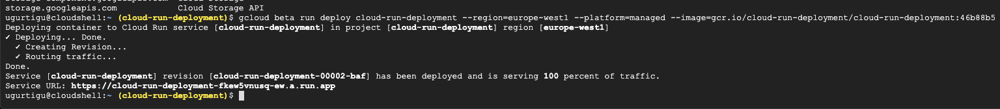
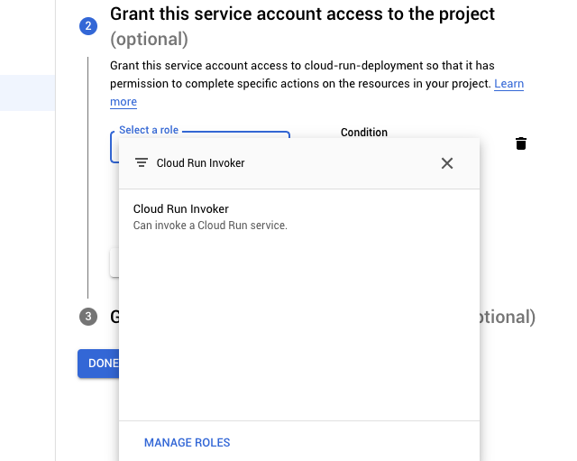
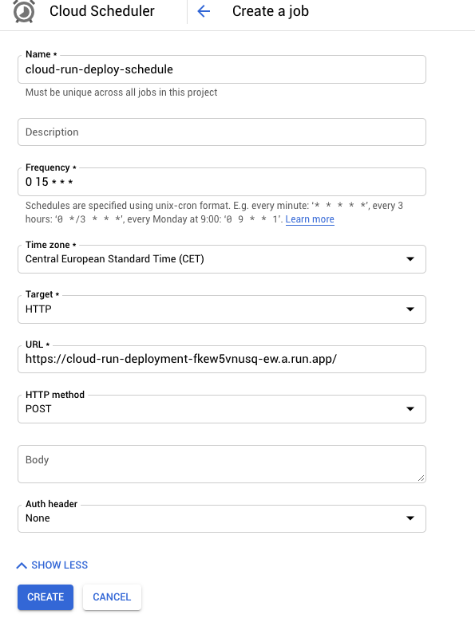
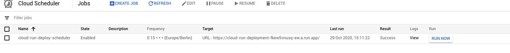

# Continous Deployment with Cloud Build & Cloud Run

## 1. Make an application & docker image
- in google cloud mkdir and cd to a project folder
- create new project with a server file and a Dockerfile in the project folder (could be node.js server, or any type of server application) on google cloud


- build an image with docker on your google cloud

## 2. Connect to github to make continuous integration
- create a repo with the same files (server file, Dockerfile)


## 3. Connect github to cloud build
- go into cloud build
- enable cloud build api
- connect new repo with trigger (choose github mirrored) and authenticate with oauth


- select repository & connect 
- every time when google sees a commit it will run what we have configured here, this is the build configuration we need at first, later we will change this to cloud build with a yaml file
- run trigger, the build is started 
## 4. Cloud run integration
- go into cloud run
- create a service and select container image and location (allow unauthenticated invocations)

- the server is now running on cloud run

## 5. Combine cloud build with cloud run
- we need to automatically deploy with cloud build 
- first change cloud build to build with cloudbuild.yaml instead of Dockerfile
- go to cloud build - triggers - edit trigger and change build configurations

- make a new cloudbuild.yaml (with the same project name) and commit it to the repo

```shell
steps:
- name: 'gcr.io/cloud-builders/docker'
  args: ['build', '-t', 'gcr.io/cloud-run-deployment/cloud-run-deployment:$SHORT_SHA', '.']
- name: 'gcr.io/cloud-builders/docker'
  args: ['push', 'gcr.io/cloud-run-deployment/cloud-run-deployment:$SHORT_SHA']
```
- we have a new build with cloudbuild.yaml
- deploy image with gcloud in the terminal

```shell
gcloud beta run deploy [NAME-OF-PROJECT][--REGION][--PLATFORM][--IMAGE]
```


- this command has to be copied into the cloudbuild.yaml file like so, the new cloudbuild.yaml looks like this now:

```shell
steps:
- name: 'gcr.io/cloud-builders/docker'
  args: ['build', '-t', 'gcr.io/cloud-run-deployment/cloud-run-deployment:$SHORT_SHA', '.']
- name: 'gcr.io/cloud-builders/docker'
  args: ['push', 'gcr.io/cloud-run-deployment/cloud-run-deployment:$SHORT_SHA']
- name: 'gcr.io/cloud-builders/gcloud'
  args: ['beta', 'run', 'deploy', 'cloud-run-deployment', '--region=europe-west1', '--platform=managed', '--image=gcr.io/cloud-run-deployment/cloud-run-deployment:$SHORT_SHA']
```
- go to triggers, you now will see a new one which we generated with the cloudbuild.yaml instead of the old one
- the build will have an error (PERMISSION_DENIED), to solve this error just go to settings and activate cloud run and retry the build

- change the server file and push


# Creating a scheduler for the server file
## 1. Create a service account
- Go into the admin console https://console.cloud.google.com/projectselector2/iam-admin and select the recent project
- create a new serviceaccount, it's important to grant this service account access "Cloud Run Invoker"

- you can also achive this with the cli

```shell
gcloud iam service-accounts create SERVICE_ACCOUNT_ID

gcloud iam service-accounts add-iam-policy-binding \
    SERVICE_ACCOUNT_ID
    --member "serviceAccount:SERVICE_ACCOUNT_ID@PROJECT_ID.iam.gserviceaccount.com" \
    --role "roles/run.invoker"
```
## 2. Create a Cloud Scheduler job

- go to https://console.cloud.google.com/cloudscheduler and create a new job
- give the url for which the scheduler should work

- after submitting you can test the job 


